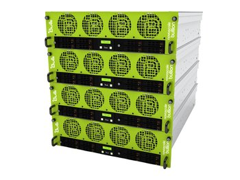

Algoric est un projet de **mésocentre HPC** au sein d'un fablab, [La Fabrique du Loch](http://www.lafabriqueduloch.org)
à Auray, dans le Morbihan, une aventure humaine palpitante pour un projet inédit!
[C'est quoi un mésocentre HPC?](definitions.md)

Sur la base de son expertise dans le domaine du super-calcul, un membre du fablab
a proposé de sensibiliser les membres de l'association au super-calcul par la gestion
de serveurs dédiés. Quelques uns de nos adhérents utilisent déjà le super-calcul pour des simulations d'effort
sur des structures, du routage.

L'association peut se fournir en matériel auprès de centres de super-calcul désireux
de recycler le matériel amorti.

# Ce matériel a besoin d'une maison!
Nous cherchons **une salle informatique** entre Vannes et Lorient qui pourrait héberger
nos [machines](hardware.md).

## Quelles sont nos motivations?

Dans le cadre d’un centre de super-calcul à l'échelle régionale,
les relations humaines importent plus que la puissance du calculateur mise à disposition.

### Sensibiliser au calcul
Le calcul prend une part de plus en plus importante dans l'informatique actuelle,
et par incidence dans notre monde. Les entreprises ont amélioré leur productivité
grâce au calcul permis par des ordinateurs toujours plus puissants.

L'Intelligence Artificielle utilise massivement le calcul au sein de centres HPC.
Le plus gros calculateur en France compte plus de 500 000 coeurs qui peuvent opérer
ensemble sur de très larges registres de données simultanément.

### Former au calcul
Aujourd'hui, les experts en super-calcul ainsi que l'ensemble des compétences requises
en gestion de salle informatique sont peu nombreuses. Ce projet est l'occasion
de former des adhérents aux différentes compétences requises pour ce type d'infrastructure
(admnistration des machines, préparation des calculs, ingénierie du calcul parallèle ).

### Faciliter l'accès au calcul
Avec une infrastructure simple et locale, gérée par un expert du super-calcul,
ce projet permet l'accès à des ressources inaccessibles dans les centres publics;
Les infrastructures commerciales ne proposent pas d'accompagnement.

Pour aller plus loin:
- [Le super-calcul](definitions.md)
- [Les missions d'un centre régional](missions.md)

# Le projet Algoric en détails
- [Le hardware](hardware.md)
- [Le software](software.md)
- [Des compétences](competences.md)

Nous cherchons aujourd'hui un local pour accueillir nos machines.
- [Les besoins](besoins.md)
